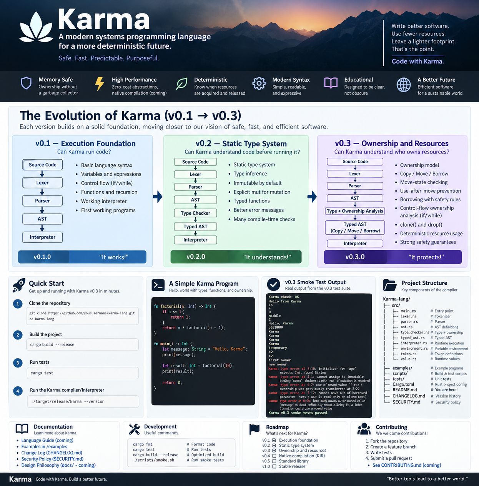

# Karma Programming Language

<p align="center">
  
</p>

<p align="center">
  <strong>A security-first, memory-conscious programming language designed to evolve toward predictable native systems and enterprise software.</strong>
</p>

---

## What is Karma?

Karma is an experimental programming language being built step by step from first principles.

The project is focused on a few long-term goals:

- **Security by design** — invalid or dangerous states should be rejected as early as possible.
- **Memory efficiency** — ownership and resource lifetime should be explicit and predictable.
- **Low runtime overhead** — avoid requiring a large mandatory VM, JIT, or tracing garbage collector.
- **Native execution** — the long-term target is ahead-of-time compilation to native machine code.
- **Process friendliness** — small startup footprint, predictable resource use, and no unnecessary background work.
- **Modern + older systems** — use conservative platform baselines with optimized paths for newer hardware.
- **Enterprise usability** — APIs, databases, messaging, observability, tooling, and distributed-systems support will come after the language core is stable.

> Karma is **not** a Java wrapper and does not depend on the JVM.  
> Rust and Cargo are currently used only to bootstrap the first Karma compiler/interpreter.

---

# Current Status

**Latest validated milestone: `v0.3.0` — Ownership & Resource Foundation**

Karma currently supports:

- variables
- arithmetic and comparisons
- `if / else`
- `while`
- functions
- recursion
- `Int`
- `Bool`
- `String`
- `Unit`
- static type checking
- type inference for supported bindings
- immutable `let`
- explicit `mut`
- typed function parameters
- typed return values
- return-path checking
- ownership tracking
- `Copy`
- `Move`
- `Borrow`
- `clone(...)`
- `drop(...)`
- use-after-move prevention
- conservative ownership analysis across branches and loops
- source-positioned compiler/type errors
- checked integer arithmetic
- runtime safety limits

The v0.3 smoke-test suite is passing on macOS.

---

# Version Evolution

## v0.1.0 — Execution Foundation

The first goal was simple:

> **Can Karma understand and run a real `.kr` program?**

Architecture:

```text
Karma source (.kr)
        |
        v
      Lexer
        |
        v
      Tokens
        |
        v
      Parser
        |
        v
       AST
        |
        v
   Interpreter
        |
        v
      Output
```

v0.1 introduced:

- lexer/tokenizer
- parser
- AST
- interpreter
- variables
- expressions
- control flow
- functions
- recursion
- CLI execution
- checked integer arithmetic
- runtime execution limits
- readable errors

Example:

```karma
fn factorial(n) {
    if n <= 1 {
        return 1;
    }

    return n * factorial(n - 1);
}

print(factorial(10));
```

---

## v0.2.0 — Static Type System

The next question became:

> **Can Karma prove that a program is semantically valid before it executes?**

Architecture:

```text
Source
  |
  v
Lexer
  |
  v
Parser
  |
  v
Raw AST
  |
  v
Symbol + Type Analysis
  |
  v
Typed AST
  |
  v
Interpreter
```

v0.2 added:

- `Int`
- `Bool`
- `String`
- `Unit`
- static type checking
- typed bindings
- typed functions
- typed return values
- immutable `let`
- explicit `mut`
- function argument validation
- return-type validation
- Boolean-only control-flow conditions
- return-on-all-paths checking
- Typed AST

Valid:

```karma
let age: Int = 38;

fn add(a: Int, b: Int) -> Int {
    return a + b;
}
```

Rejected before execution:

```karma
let age: Int = "hello";
```

Also rejected:

```karma
let count: Int = 10;
count = 20;
```

Use explicit mutation instead:

```karma
mut count: Int = 10;
count = 20;
```

---

## v0.3.0 — Ownership & Resource Foundation

v0.3 asks a deeper question:

> **Who owns a resource, and what happens when ownership changes?**

Architecture:

```text
Source
  |
  v
Lexer
  |
  v
Parser
  |
  v
Raw AST
  |
  v
Type + Ownership Analysis
  |
  +-- Types
  +-- Mutability
  +-- Move state
  +-- Borrow mode
  +-- Branch ownership merge
  +-- Loop ownership analysis
  |
  v
Typed AST
  |
  +-- Copy
  +-- Move
  +-- Borrow
  |
  v
Interpreter
```

### Copy

Small scalar values can be copied:

```karma
let a: Int = 10;
let b: Int = a;

print(a);
print(b);
```

Both remain valid.

### Move

Owned values such as `String` move by default:

```karma
let first: String = "Karma";
let second: String = first;

print(second);
print(first); // rejected: first was moved
```

### Borrow

Functions can temporarily read an owned value without taking ownership:

```karma
fn show(text: borrow String) -> Unit {
    print(text);
}

let language: String = "Karma";

show(language);
print(language);
```

### Clone

Intentional logical duplication is explicit:

```karma
let original: String = "Karma";
let duplicate: String = clone(original);

print(original);
print(duplicate);
```

### Drop

Ownership can be explicitly ended:

```karma
let temporary: String = "temporary";

drop(temporary);

// print(temporary); // rejected
```

### Control-flow ownership

Karma also tracks ownership through `if` and `while`.

For example:

```karma
let data: String = "Karma";

if condition {
    drop(data);
}

print(data);
```

is rejected because `data` is not guaranteed to still exist after the branch.

This is the beginning of real ownership data-flow analysis.

---

# Quick Start

## Requirements

Karma is currently bootstrapped with Rust.

Install Rust/Cargo on macOS:

```bash
brew install rust
```

Check:

```bash
rustc --version
cargo --version
```

---

## Build

From the repository root:

```bash
cargo build --release
```

The executable is produced at:

```text
target/release/karma
```

Check the version:

```bash
./target/release/karma --version
```

Expected:

```text
Karma 0.3.0
```

---

## Run Tests

```bash
cargo test
```

Format the Rust bootstrap source:

```bash
cargo fmt
```

Run the v0.3 smoke suite:

```bash
./scripts/smoke.sh
```

---

# Run Karma Programs

Run an example:

```bash
./target/release/karma examples/hello.kr
```

Run the ownership example:

```bash
./target/release/karma examples/ownership.kr
```

Static-check a file without running it:

```bash
./target/release/karma --check examples/move_error.kr
```

---

# v0.3 Safety Examples

## Type mismatch

```karma
let age: Int = "hello";
```

Expected:

```text
karma: type error ... initializer for 'age' expects Int, found String
```

## Immutable binding

```karma
let count: Int = 10;
count = 20;
```

Expected:

```text
cannot assign to immutable binding 'count'
```

## Use after move

```karma
let first: String = "Karma";
let second: String = first;

print(first);
```

Expected:

```text
use of moved value 'first'
```

## Borrow escape

```karma
fn steal(text: borrow String) -> String {
    return text;
}
```

Expected:

```text
cannot move out of borrowed parameter 'text'
```

## Unsafe loop-carried move

```karma
let message: String = "Karma";

while condition {
    drop(message);
}
```

Expected:

```text
loop body moves outer owned value 'message'
without definitely reinitializing it
```

---

# Validated v0.3 Smoke Test

The v0.3 smoke suite successfully exercised:

- basic execution
- arithmetic
- control flow
- functions
- recursion
- static typing
- mutable bindings
- ownership moves
- borrowing
- cloning
- dropping
- copy semantics
- type-error rejection
- immutable-binding rejection
- use-after-move rejection
- borrow-escape rejection
- loop ownership rejection

Final smoke-test result:

```text
Karma v0.3 smoke tests passed.
```

---

# Project Structure

```text
karma-lang/
|
|-- Cargo.toml
|-- Cargo.lock
|-- README.md
|-- CHANGELOG.md
|-- SECURITY.md
|
|-- src/
|   |-- main.rs
|   |-- token.rs
|   |-- lexer.rs
|   |-- parser.rs
|   |-- ast.rs
|   |-- source.rs
|   |-- types.rs
|   |-- type_checker.rs
|   |-- typed_ast.rs
|   |-- environment.rs
|   |-- interpreter.rs
|   `-- value.rs
|
|-- examples/
|
|-- tests/
|
|-- scripts/
|   |-- smoke.sh
|   `-- install-local.sh
|
`-- docs/
```

---

# How the Compiler Works Today

```text
                 .kr source
                     |
                     v
                   Lexer
                     |
                     v
                   Tokens
                     |
                     v
                   Parser
                     |
                     v
                  Raw AST
                     |
                     v
          Type + Ownership Checker
                     |
                     v
                 Typed AST
              /      |      \
           Copy     Move    Borrow
                     |
                     v
           Bootstrap Interpreter
                     |
                     v
                  Output
```

The interpreter is currently the execution engine.

The planned architecture is:

```text
Typed AST
   |
   v
  KIR
   |
   v
Optimizer
   |
   v
Native Backend
   |
   +-- ARM64
   +-- x86-64
   `-- future targets
```

---

# Important Bootstrap Note

Karma is currently implemented in Rust, but Karma is **not based on Rust**.

Today:

```text
Rust source
    |
 Cargo / rustc
    |
    v
native `karma` executable
    |
    v
Karma `.kr` programs
```

Once `karma` is built, Cargo is not involved in running `.kr` programs.

Long term:

```text
Rust
  |
  v
first Karma compiler
  |
  v
compiler rewritten in Karma
  |
  v
Karma compiles Karma
```

This is called **self-hosting**.

---

# Install Karma Locally

Build first:

```bash
cargo build --release
```

Then:

```bash
./scripts/install-local.sh
```

The local executable is installed to:

```text
~/.local/bin/karma
```

For macOS `zsh`, add it to `PATH`:

```bash
echo 'export PATH="$HOME/.local/bin:$PATH"' >> ~/.zshrc
source ~/.zshrc
```

Verify:

```bash
which karma
karma --version
```

Then you can run:

```bash
karma examples/hello.kr
```

---

# Security Philosophy

Karma is being designed so safety is a language/compiler responsibility rather than only a library convention.

Current foundations include:

- static type checking
- immutable-by-default bindings
- explicit mutation
- checked integer arithmetic
- bounded interpreter execution
- ownership transfer
- use-after-move prevention
- call-scoped read-only borrowing
- explicit clone intent
- explicit early drop
- conservative branch/loop ownership analysis
- no `unsafe` Rust in the bootstrap compiler core

Future security work includes:

- capability-based filesystem/network/process access
- stronger resource lifetime analysis
- secret-safe types
- safe FFI boundaries
- package capability declarations
- reproducible builds
- dependency verification
- fuzzing
- compiler hardening

---

# Memory Model Direction

Karma does **not** currently promise a final native memory representation.

The language-level direction is:

```text
small scalar values
    -> Copy

owned values/resources
    -> Move by default

read-only function access
    -> Borrow

intentional duplication
    -> clone(...)

early ownership end
    -> drop(...)

scope end
    -> deterministic cleanup
```

Later native code generation can decide whether data belongs on:

- the stack
- an arena/region
- the heap
- a specialized allocation strategy

without changing the high-level ownership rules.

---

# Roadmap

### Completed

- [x] `v0.1` — execution foundation
- [x] `v0.2` — static type system
- [x] `v0.3` — ownership/resource foundation

### Next

- [ ] `v0.4` — KIR + native compilation foundation
- [ ] `v0.5` — modules and packages
- [ ] `v0.6` — concurrency and structured tasks
- [ ] `v0.7` — I/O and networking
- [ ] `v0.8` — enterprise runtime foundations
- [ ] `v0.9` — data and messaging
- [ ] `v0.10` — security hardening
- [ ] `v0.11` — developer tooling
- [ ] `v0.12` — release candidate / hardening
- [ ] `v1.0` — stable production language

Longer term:

- [ ] compiler self-hosting
- [ ] stable ABI strategy
- [ ] multiple native targets
- [ ] package ecosystem
- [ ] LSP / IDE support
- [ ] debugger integration
- [ ] enterprise libraries
- [ ] long-term support releases

---

# Development Commands

Format:

```bash
cargo fmt
```

Run tests:

```bash
cargo test
```

Optimized build:

```bash
cargo build --release
```

Run smoke tests:

```bash
./scripts/smoke.sh
```

Run Karma:

```bash
./target/release/karma examples/hello.kr
```

Static check:

```bash
./target/release/karma --check examples/move_error.kr
```

---

# Release Philosophy

Every Karma release should:

1. define the release objective first
2. document new semantics
3. add automated tests
4. test invalid programs as well as valid ones
5. build successfully on real hardware
6. run the smoke suite
7. keep compiler warnings at zero where practical
8. document architecture changes
9. create/update release diagrams
10. commit and tag the known-good state before the next release begins

---

# Contributing

Karma is still early-stage and the language design is evolving.

A clean contribution flow is:

```bash
git checkout -b feature/my-change

cargo fmt
cargo test
cargo build --release
./scripts/smoke.sh
```

Then review the diff and open a pull request.

When contributing to language semantics, include:

- the problem being solved
- syntax changes
- semantic rules
- valid examples
- invalid examples
- compiler diagnostics
- tests
- compatibility implications
- memory/security implications

---

# Current Philosophy in One Picture

```text
v0.1
Can Karma run code?
        |
        v
Execution

v0.2
Can Karma understand code?
        |
        v
Static Types

v0.3
Can Karma understand ownership?
        |
        v
Memory / Resource Safety

v0.4
Can Karma compile those guarantees natively?
        |
        v
KIR + Native Code
```

---

<p align="center">
  <strong>Karma is still early — but it is already a real, tested language implementation.</strong>
</p>

<p align="center">
  Code with Karma. Build a better future.
</p>
