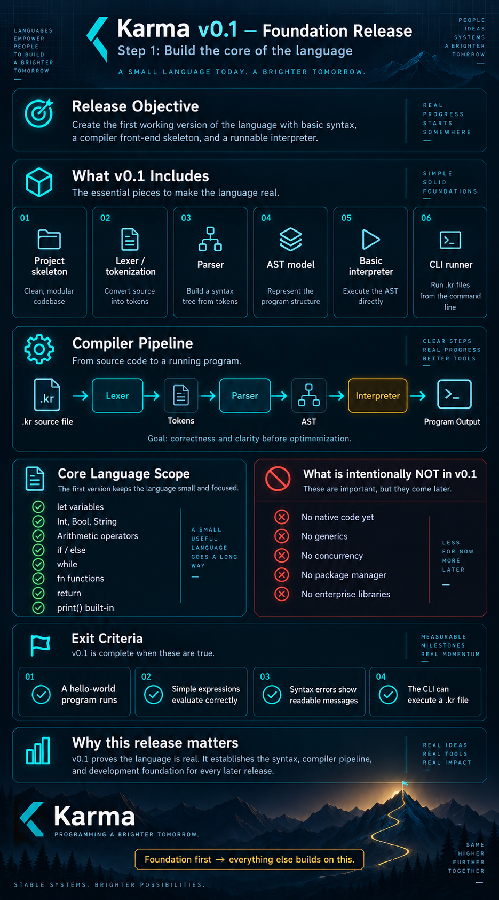

# Karma Programming Language — v0.1 Bootstrap



Karma is an experimental programming language project focused on security, memory efficiency, predictable runtime behavior, native compilation, and long-term system compatibility.

This repository is the first working bootstrap milestone.

## v0.1 pipeline

```text
.kr source -> Lexer -> Tokens -> Parser -> AST -> Interpreter -> Output
```

v0.1 is intentionally interpreted. The interpreter is a bootstrap backend, not Karma's production runtime. Native compilation is planned behind the same front-end boundary.

## Current syntax

```karma
fn factorial(n) {
    if n <= 1 {
        return 1;
    }
    return n * factorial(n - 1);
}

let answer = factorial(10);
print(answer);
```

## Prerequisite

Install a current stable Rust toolchain.

### macOS

With Homebrew:

```bash
brew install rust
```

Or install Rust using the official rustup installer.

### Linux

Install Rust using your distribution package manager or rustup.

Verify:

```bash
rustc --version
cargo --version
```

## Build

```bash
cargo build
```

Run tests:

```bash
cargo test
```

Run Karma:

```bash
cargo run -- examples/hello.kr
cargo run -- examples/functions.kr
```

Release build:

```bash
cargo build --release
./target/release/karma examples/hello.kr
```

## Expected output

`examples/hello.kr`:

```text
Hello from Karma!
```

`examples/functions.kr`:

```text
3628800
```

## Security baseline in v0.1

- `unsafe` Rust is forbidden in the crate.
- No external Rust dependencies.
- Checked integer arithmetic.
- Division-by-zero protection.
- Bounded source size.
- Bounded bootstrap execution steps.
- Bounded function call depth.
- No file/network/process/FFI access exposed to Karma programs.
- No background threads.

See `docs/DESIGN_CONSTITUTION.md` and `docs/ARCHITECTURE.md`.

## Not yet in v0.1

Static typing, `Option`/`Result`, ownership/lifetimes, KIR, LLVM/native code generation, packages, concurrency, networking, databases, and enterprise runtime libraries are intentionally deferred.

## Version plan

The immediate sequence is:

```text
v0.1  working language front end + interpreter
v0.2  static type system
v0.3  production memory model
v0.4  KIR + native compilation
```
